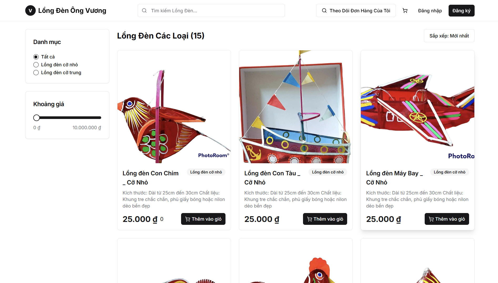

# 🏮 Lantern Store - Frontend

A modern e-commerce frontend for a lantern-selling platform, where users can browse products, place orders using their phone number, and track order status. Built with **Next.js** and **Tailwind CSS**, and fully integrated with a custom backend API.

---

## ✨ Technologies

- **Next.js** – React framework for server-side rendering, routing, and SEO optimization
- **ReactJS** – Component-based UI library
- **Tailwind CSS** – Utility-first CSS framework for fast styling
- **Axios** – Promise-based HTTP client for API communication
- **Environment Variables (.env)** – For backend API config

---

## 🚀 Features

- 🏮 Product listing by category
- 📱 Phone-based order placement 
- 🔍 Order tracking by phone number
- 🛍️ Cart and checkout system 
- 🛠️ Admin page integration 
- 📱 Fully responsive layout
- ⚡ Server-side rendering for SEO optimization

---

## 📍 The Process

The Lantern Store project is a real-world e-commerce solution built to support a small lantern business. I wanted to deliver a simple yet effective shopping experience for users, especially those using mobile devices. 

I chose **Next.js** for its excellent performance, built-in routing, and server-side rendering which improves both speed and SEO — important for product visibility. Tailwind CSS made it fast and easy to design a clean, responsive UI. The frontend interacts seamlessly with the backend API to provide real-time product listings, order placement, and tracking.

This app demonstrates my ability to create a complete frontend for real-world use, with future scalability in mind.

---

## 🚦 Running the Project

1. Clone the repository
2. Install dependencies: npm install
3. Run development server: npm run dev
4. Open http://localhost:3000 in your browser

## 🎞️ Preview

